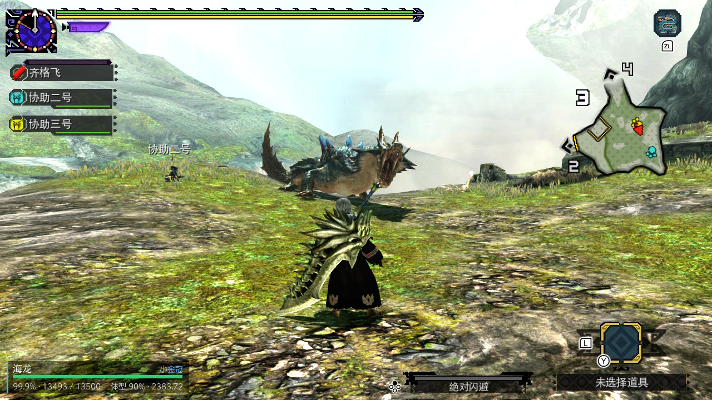

# MHGU Overlay

A multilingual monster HUD and crown-size controller for MHGU on Nintendo
Switch.

> [!IMPORTANT]
> The current target is **MHGU 1.4.0 on Nintendo Switch**. The overlay builds
> successfully in CI, but its memory profile and size-writing behavior still
> require systematic testing on real hardware.

## Features

- Lower-left compact HUD for health, size, crown class, and Hyper status.
- English, Simplified Chinese, and Japanese, with automatic detection and
  English fallback.
- Per-monster size presets: Off, Mini, Silver, and Gold.
- Conservative, version-gated memory access with bounds checks and immediate
  write verification.
- Portable gameplay core separated from the Switch and Tesla adapters.

## Requirements

- MHGU 1.4.0 for Nintendo Switch
- Atmosphère with `dmnt:cht`
- Tesla Menu / ovlmenu

## Install

1. Download `mhgu-overlay.ovl` from the
   [latest release](https://github.com/jinghaihan/mhgu-overlay/releases/latest),
   or download the `mhgu-overlay` artifact from a successful
   [build workflow](https://github.com/jinghaihan/mhgu-overlay/actions/workflows/build.yml).
2. Copy it to `sdmc:/switch/.overlays/mhgu-overlay.ovl`.
3. Start MHGU 1.4.0, open Tesla Menu, and select **MHGU Overlay**.

## Use

- **Open compact HUD** hides the settings page and returns input to the game.
- Hold `L3 + R3` in the compact HUD to return to settings.
- Press `B` on the settings page to close the overlay.
- Choose the language manually or leave it on **Auto**.
- Choose a size preset before entering a quest; **Off** is the default.
- Use **Find monster list** to discard the cached pointer and scan again.

Settings are saved to `sdmc:/config/mhgu-overlay/settings.ini`.

> [!WARNING]
> Size presets modify live game memory. They do not edit quest definitions or
> support arbitrary multipliers. Back up your save, avoid online use, and read
> [Size presets and safety](docs/size-lock.md) before enabling them.

## Documentation

- [Development guide](docs/development.md) — setup, testing, building, data,
  localization, and releases
- [Architecture](docs/architecture.md) — module boundaries, runtime flow, and
  future adapters
- [Size presets and safety](docs/size-lock.md) — behavior, validation, and
  hardware-testing limits

## Credits

This is an independent implementation. The following projects and sites were
used as prior art or factual references; their source, documentation,
screenshots, and media are not copied into this repository.

- [minazuki19/MHGU-Monster-Info-Overlay](https://github.com/minazuki19/MHGU-Monster-Info-Overlay)
  — prior research into MHGU memory behavior on Switch.
- [Alexander-Lancellott/MHGU-MHXX-HP-Overlay-For-Switch-Emulator](https://github.com/Alexander-Lancellott/MHGU-MHXX-HP-Overlay-For-Switch-Emulator)
  — desktop overlay and monster-size prior art.
- [3096/feth-overlays](https://github.com/3096/feth-overlays) — prior art for
  version-gated Switch memory editing.
- [Kiranico MHXX](https://mhxx.kiranico.com/) — authoritative base sizes and
  crown thresholds used by the catalog pipeline.
- [MH Crown](https://mhcrown.com/) — independent crown-size cross-checks.
- [libtesla](https://github.com/minazuki19/libtesla) and
  [Atmosphere-libs](https://github.com/Atmosphere-NX/Atmosphere-libs) — Switch
  runtime dependencies included as Git submodules under their own licenses.

Monster Hunter and related names are trademarks of Capcom. This unofficial
fan project is not affiliated with or endorsed by Capcom.

## License

[MIT](LICENSE) © 2025 Jing Haihan
