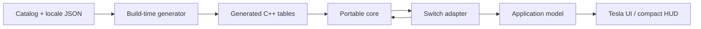
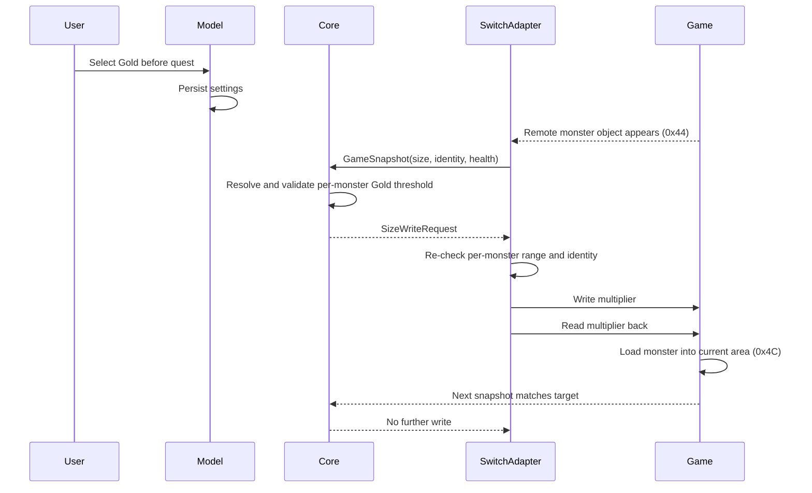

# Architecture

## Goals

MHGU Overlay is split so that monster logic can survive a platform rewrite. The Nintendo Switch build is the first adapter, not the definition of the application.

The architecture has four rules:

1. The core must not include libnx, Tesla, process-memory APIs, filesystem paths, or raw game offsets.
2. Platform adapters translate native state into stable core types.
3. User-facing text lives in locale data, not gameplay tables or UI source.
4. Memory writes require explicit intent, identity checks, bounds checks, and read-back verification.

## Dependency direction



Dependencies point inward. The core knows nothing about the Switch adapter or Tesla UI.

## Repository layout

```text
include/mhgu/
├── core/               Portable types, engine, size and locale APIs
├── platform/switch/    Version profiles and adapter interfaces
└── app/                Settings and thread-safe application model

source/
├── core/               Platform-independent decisions
├── generated/          Reproducible catalog and translation tables
├── platform/switch/    dmnt:cht, language detection, scanning and writes
├── app/                Persistence and worker coordination
└── ui/                 Tesla rendering and input

data/
├── catalog/            Language-independent monster facts
├── locales/            One authoritative file per supported locale
└── schema/             Machine-readable data contracts
```

## Portable core

The portable core exchanges values, never process addresses with implicit meaning.

`GameSnapshot` is the adapter input:

- game identity;
- detected locale;
- stable monster ID;
- opaque monster handle;
- current and maximum health;
- current size percentage;
- Hyper flag.

`CoreOutput` is the UI and adapter output:

- localized `MonsterView` values;
- health percentage;
- actual size;
- crown classification;
- zero or more validated `SizeWriteRequest` intents.

The opaque handle is carried through the core but never dereferenced there. A future Windows or emulator adapter can use a native pointer, process-relative address, object token, or another stable identifier.

## Catalog and internationalization

Gameplay facts and translations have different lifecycles, so they are stored separately.

`data/catalog/monsters.json` contains:

- stable numeric ID and string key;
- base size in fixed-point hundredths;
- Mini, Silver, and Gold threshold percentages;
- fixed/variable-size capability;
- Switch raw identifier;
- source URLs.

`data/catalog/legal-size-ranges.json` contains the conservative write range
for every variable-size monster. Kiranico crown thresholds are authoritative:
the Mini threshold is the lower bound and the Gold threshold is the upper
bound. MH Crown is queried only to record whether its published sizes match,
disagree, or are unavailable. A disagreement cannot expand the write range.

`data/locales/<locale>.json` contains:

- UI messages;
- monster names keyed by the stable catalog key.

The generator rejects missing or extra monster keys in any locale. Adding a language therefore means adding one locale file and extending the locale enum/generator mapping; it does not require editing monster facts or Switch code.

Floating-point source values are converted to fixed-point integers during data generation. Crown classification and displayed actual sizes remain deterministic across platforms.

## Switch adapter

### Game profiles

Raw offsets are isolated in `GameProfile`. The current profile contains:

| Field | Monster-relative offset |
| --- | ---: |
| map/location flag | `0x000D` |
| secondary identifier | `0x15EA` |
| size multiplier (`float`) | `0x15F0` |
| current health | `0x17B0` |
| maximum health | `0x17B4` |
| primary identifier | `0x7628` |

The pointer-list structure is decoded byte by byte instead of relying on compiler packing. Its pointer array begins at `0x18`, its count is at `0x40`, and it has capacity for ten 32-bit guest pointers.

These values are reverse-engineering facts derived from community prior art and isolated so a game update can add a new profile without changing core behavior.

### Attachment and scanning

`GameSession` uses Atmosphère's `dmnt:cht` service to:

1. detect the current cheat process;
2. read its title ID and heap base;
3. require a supported Title ID and build ID profile;
4. scan the profile's bounded heap range in 64 KiB chunks;
5. validate candidate list markers, padding, pointer continuity, count, and the first monster identity;
6. read each monster field individually and retain live objects marked either
   remote (`0x44`) or present in the current area (`0x4C`).

The recognized build profile also contains the 30/60 FPS pointer chain and
its two legal float bit patterns. The adapter bounds the pointer read to the
main NSO, bounds the resolved target to the process address space, rejects an
unexpected current value, and immediately reads every write back. A saved
frame-rate preference is synchronized whenever a recognized game process
attaches. The adapter accepts only the profile's known 30 FPS and 60 FPS bit
patterns before writing, so an unrelated value is rejected instead of being
overwritten.

The map and large-monster-location selector applies two static ARM instruction
patches from the same build profile. Both addresses are validated against the
main NSO before either write begins; each write is then read back immediately.
The carry-items-into-pouch and invincibility selectors each apply one
instruction through the same validated path.

Code-patch selectors are reversible. Before applying any saved patch state,
the adapter loads a baseline keyed by the MHGU title ID, recognized build-ID
prefix, and the complete sorted set of profile offsets. A missing baseline is
captured only while the game process is paused and only when live memory does
not already match a known monster-damage, runtime-feature, or saved numeric
patch signature. The baseline is checksummed and persisted atomically at
`sdmc:/config/mhgu-overlay/patch-baseline.bin`, so unloading and reopening the
Tesla overlay does not lose the original instructions.

Enabling, changing, or disabling a patch pauses the process and validates the
entire affected patch set before writing. Every word is read back immediately.
If a write fails, previously written words are rolled back to their
pre-operation values; if an unexpected instruction is present, no word in the
set is changed. **Off** therefore restores the captured originals during the
current game process instead of waiting for a restart.

Selectors remain bounded patch sets keyed by portable feature identifiers. The
application model and session track requested, synchronized, and applied states
in fixed-size arrays, while all raw offsets and replacement instructions remain
inside the MHGU build profile.

Quest operations use a separate profile layout. The adapter loads the game's
32-bit quest-object pointer from the recognized main module, validates every
resolved field against the process address space, and immediately reads each
write back. Infinite time and unlimited faints are persistent requests that
become no-ops while no quest object exists. Completing a quest is an explicit
one-shot request from the Tesla menu and is never persisted.

Candidate validation prevents a coincidental byte pattern from becoming a
write target. A failed list validation discards the address and forces a new
scan. Unknown location states and defeated objects are rejected. Immediately
before a size write, the adapter rechecks list membership, location state,
identity, health, the existing multiplier, and the per-monster legal range.

### Monster identity

The game exposes a primary and secondary identifier. Regional primary-ID variants are normalized before lookup. Exact aliases are checked first. If no exact alias exists and the secondary ID contains the Hyper bit, the base alias is checked and the view is marked Hyper.

Small-monster secondary IDs are rejected before catalog lookup.

### Automatic language detection

For MHGU, the adapter asks libnx for the application's control data and desired language. If that service is unavailable, it falls back to the system language. MHXX is a Japanese-only profile and therefore selects Japanese automatically.

Mappings are deliberately narrow:

- Japanese → Japanese;
- English → English;
- Simplified or Traditional Chinese → Simplified Chinese UI;
- every other language or error → English.

A manual language setting always wins. The Switch adapter selects a profile by
Title ID and Build ID before it creates the monster reader or applies any
profile-backed write.

## Application model and threading

Tesla rendering and memory scanning have different timing requirements.

- The UI thread reads immutable copies of `SessionView` and edits settings.
- A worker thread performs a full game poll every 250 ms. When damage display
  is enabled, it also samples current and maximum large-monster health every
  33 ms from the already validated monster handles.
- Settings and view copies are protected by a short-held mutex.
- The potentially slow heap scan and all `dmnt:cht` calls remain on the worker.
- Settings are persisted atomically through a temporary file and rename.

The compact HUD draws independent translucent monster cards using a persisted layout preset: bottom-left vertical, left-center vertical, top-right vertical, right-center vertical, or top-center horizontal. The top-center layout uses up to three centered columns and wraps additional cards; unusually large card stacks move damage events lower to avoid overlap. Its information hierarchy is inspired by desktop overlays, while the implementation and visual treatment are native to this project. An optional portable damage tracker converts decreases between health samples into short-lived events; Tesla renders those events as animated values at a fixed screen position rather than attempting to project monster coordinates. The HUD releases foreground input to the game, renders at a higher refresh rate while damage display is enabled, and otherwise uses the lower refresh rate. Holding both sticks returns to the full settings UI.

The Tesla UI is organized under `source/ui/components/` by responsibility:
damage text, shared menu items, HUD rendering, submenus, and the main menu.
These `.hpp` files are intentionally assembled by `source/ui/main.cpp` into a
single translation unit. The bundled libtesla fork defines non-inline runtime
symbols in its public header, so compiling several Tesla-facing `.cpp` files
would create duplicate linker definitions. This structure keeps navigation and
editing manageable without weakening linker checks or modifying the submodule.

## Quest size preset flow



The overlay cannot edit a monster that does not exist yet. “Before quest”
therefore means the user's choice is saved before loading; application occurs
immediately after the runtime object becomes available. The single selector
cycles through Off, Mini, Silver, and Gold; Off makes the core emit no writes.
If area loading replaces or resets the multiplier, the next snapshot differs
from the preset and the same validated request is emitted again.

Size legality is global per monster rather than map- or quest-specific. The
location-state allowlist protects object identity and lifetime; it does not
choose a different legal range. “Silver” means the large silver crown; MHGU
has no small silver crown category. Fixed-size monsters, Off mode, unknown
identities or location states, defeated objects, implausible health, invalid
multipliers, and targets outside the selected monster's conservative Kiranico
range all stop the write path.

## Future adapters

A future Windows or Ryujinx adapter needs to implement three responsibilities:

1. produce a `GameSnapshot`;
2. apply a `SizeWriteRequest` with platform-appropriate validation;
3. supply detected language and persistent settings.

It can reuse:

- monster catalog and locale files;
- generated catalog tables;
- crown and actual-size calculations;
- health percentage logic;
- size-preset decisions;
- core and catalog tests.

It does not need libnx, Atmosphère, Tesla, or the Switch memory profile.

## Verification

Host CI checks:

- core size and locale behavior;
- catalog completeness across all locales;
- known crown thresholds;
- per-monster legal write ranges and rejected out-of-range writes;
- identifier normalization and Hyper resolution;
- pointer-list validation and scanning;
- bounded, verified size writes;
- bounded, verified 30/60 FPS writes;
- version-gated, bounded static instruction patches;
- baseline identity, persistence, restoration, and conflict rejection;
- settings persistence.

Switch CI compiles the complete `.ovl` with devkitA64 and both submodules. Hardware testing remains necessary for process permissions, firmware behavior, pointer profiles, visual layout, hitboxes, crown registration, and save effects.
