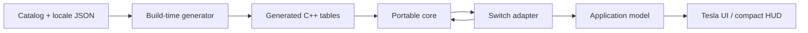
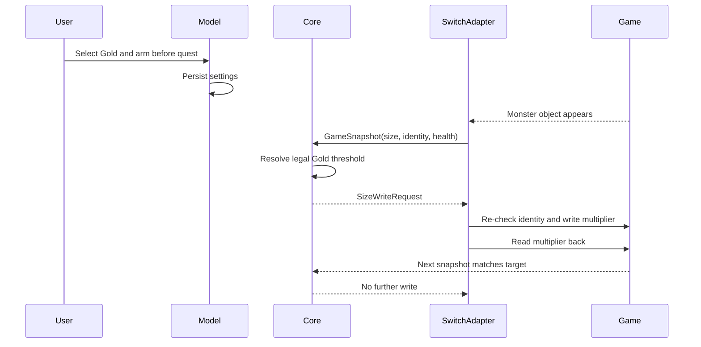

# Architecture

## Goals

MHGU Overlay is split so that monster logic can survive a platform rewrite. The Nintendo Switch build is the first adapter, not the definition of the application.

The architecture has four rules:

1. The core must not include libnx, Tesla, process-memory APIs, filesystem paths, or raw game offsets.
2. Platform adapters translate native state into stable core types.
3. User-facing text lives in locale data, not gameplay tables or UI source.
4. Memory writes require explicit intent, identity checks, bounds checks, and read-back verification.

## Dependency direction



Dependencies point inward. The core knows nothing about the Switch adapter or Tesla UI.

## Repository layout

```text
include/mhgu/
├── core/               Portable types, engine, size and locale APIs
├── platform/switch/    Version profiles and adapter interfaces
└── app/                Settings and thread-safe application model

source/
├── core/               Platform-independent decisions
├── generated/          Reproducible catalog and translation tables
├── platform/switch/    dmnt:cht, language detection, scanning and writes
├── app/                Persistence and worker coordination
└── ui/                 Tesla rendering and input

data/
├── catalog/            Language-independent monster facts
├── locales/            One authoritative file per supported locale
└── schema/             Machine-readable data contracts
```

## Portable core

The portable core exchanges values, never process addresses with implicit meaning.

`GameSnapshot` is the adapter input:

- game identity;
- detected locale;
- stable monster ID;
- opaque monster handle;
- current and maximum health;
- current size percentage;
- Hyper flag.

`CoreOutput` is the UI and adapter output:

- localized `MonsterView` values;
- health percentage;
- actual size;
- crown classification;
- zero or more validated `SizeWriteRequest` intents.

The opaque handle is carried through the core but never dereferenced there. A future Windows or emulator adapter can use a native pointer, process-relative address, object token, or another stable identifier.

## Catalog and internationalization

Gameplay facts and translations have different lifecycles, so they are stored separately.

`data/catalog/monsters.json` contains:

- stable numeric ID and string key;
- base size in fixed-point hundredths;
- Mini, Silver, and Gold threshold percentages;
- fixed/variable-size capability;
- Switch raw identifier;
- source URLs.

`data/locales/<locale>.json` contains:

- UI messages;
- monster names keyed by the stable catalog key.

The generator rejects missing or extra monster keys in any locale. Adding a language therefore means adding one locale file and extending the locale enum/generator mapping; it does not require editing monster facts or Switch code.

Floating-point source values are converted to fixed-point integers during data generation. Crown classification and displayed actual sizes remain deterministic across platforms.

## Switch adapter

### Game profiles

Raw offsets are isolated in `GameProfile`. The current profile contains:

| Field | Monster-relative offset |
| --- | ---: |
| map/location flag | `0x000D` |
| secondary identifier | `0x15EA` |
| size multiplier (`float`) | `0x15F0` |
| current health | `0x17B0` |
| maximum health | `0x17B4` |
| primary identifier | `0x7628` |

The pointer-list structure is decoded byte by byte instead of relying on compiler packing. Its pointer array begins at `0x18`, its count is at `0x40`, and it has capacity for ten 32-bit guest pointers.

These values are reverse-engineering facts derived from community prior art and isolated so a game update can add a new profile without changing core behavior.

### Attachment and scanning

`GameSession` uses Atmosphère's `dmnt:cht` service to:

1. detect the current cheat process;
2. read its title ID and heap base;
3. choose an MHGU or MHXX profile;
4. scan the profile's bounded heap range in 64 KiB chunks;
5. validate candidate list markers, padding, pointer continuity, count, and the first monster identity;
6. read each monster field individually.

Candidate validation prevents a coincidental byte pattern from becoming a write target. A failed list validation discards the address and forces a new scan.

### Monster identity

The game exposes a primary and secondary identifier. Regional primary-ID variants are normalized before lookup. Exact aliases are checked first. If no exact alias exists and the secondary ID contains the Hyper bit, the base alias is checked and the view is marked Hyper.

Small-monster secondary IDs are rejected before catalog lookup.

### Automatic language detection

For MHGU, the adapter asks libnx for the application's control data and desired language. If that service is unavailable, it falls back to the system language.

Mappings are deliberately narrow:

- Japanese → Japanese;
- English → English;
- Simplified or Traditional Chinese → Simplified Chinese UI;
- every other language or error → English.

MHXX selects Japanese in Auto mode. A manual language setting always wins.

## Application model and threading

Tesla rendering and memory scanning have different timing requirements.

- The UI thread reads immutable copies of `SessionView` and edits settings.
- A worker thread polls the game every 250 ms.
- Settings and view copies are protected by a short-held mutex.
- The potentially slow heap scan and all `dmnt:cht` calls remain on the worker.
- Settings are persisted atomically through a temporary file and rename.

The compact HUD lowers Tesla's refresh rate and releases foreground input to the game. Holding both sticks returns to the full settings UI.

## Quest size preset flow



The overlay cannot edit a monster that does not exist yet. “Before quest” therefore means the user's choice is locked in before loading; application occurs immediately after the runtime object becomes available.

Fixed-size monsters, Off mode, an unarmed lock, unknown identities, implausible health, invalid multipliers, and targets outside 50–200% all stop the write path.

## Future adapters

A future Windows or Ryujinx adapter needs to implement three responsibilities:

1. produce a `GameSnapshot`;
2. apply a `SizeWriteRequest` with platform-appropriate validation;
3. supply detected language and persistent settings.

It can reuse:

- monster catalog and locale files;
- generated catalog tables;
- crown and actual-size calculations;
- health percentage logic;
- size-preset decisions;
- core and catalog tests.

It does not need libnx, Atmosphère, Tesla, or the Switch memory profile.

## Verification

Host CI checks:

- core size and locale behavior;
- catalog completeness across all locales;
- known crown thresholds;
- identifier normalization and Hyper resolution;
- pointer-list validation and scanning;
- bounded, verified size writes;
- settings persistence.

Switch CI compiles the complete `.ovl` with devkitA64 and both submodules. Hardware testing remains necessary for process permissions, firmware behavior, pointer profiles, visual layout, hitboxes, crown registration, and save effects.
